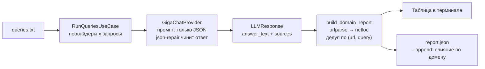
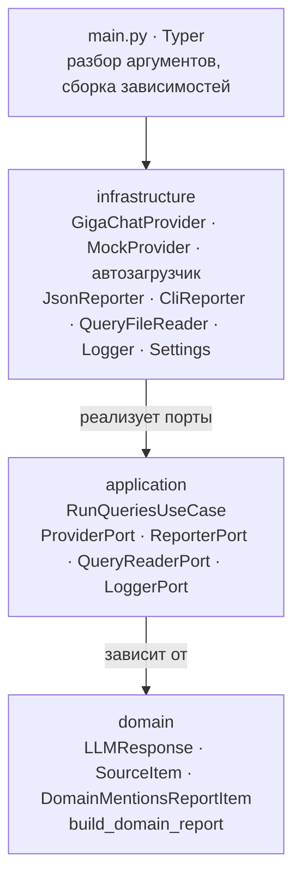

<h1 align="center">AI Source Analyzer</h1>

<p align="center">
  <b>CLI, который считает, на какие сайты ссылаются языковые модели, отвечая на ваши запросы.</b>
</p>

<p align="center">
  
  
  
  
  
  
  
</p>

---

## Зачем это

Когда пользователь спрашивает ассистента «какую электробритву взять», модель отвечает не из воздуха — она опирается на конкретные сайты. Бренду важно знать, какие это сайты и как часто они всплывают: это та же полка в магазине, только в выдаче ИИ.

Инструмент прогоняет список запросов через провайдеров, собирает все ссылки из ответов и сводит их в отчёт по доменам.

| | |
|---|---|
| **Вход** | TXT-файл, одна строка — один запрос |
| **Выход** | Отчёт по доменам: сколько раз процитирован и по каким именно запросам |
| **Провайдеры** | GigaChat; свой добавляется одним файлом |
| **Форматы** | таблица в терминале или JSON (с дозаписью в существующий отчёт) |
| **Контекст** | кейс Procter & Gamble на чемпионате Changellenge HQA15, 3-е место |

---

## Как устроен прогон



Ошибка одного провайдера на одном запросе не роняет прогон: она уходит в лог, а остальные запросы продолжают идти. Прогресс-бар считает `провайдеры x запросы`.

---

## Архитектура

Зависимости направлены внутрь: `infrastructure` знает про `application`, `application` — про `domain`, `domain` не знает ни про кого. Границы описаны портами, инфраструктура их реализует.



---

## Принятые решения

| Решение | Зачем |
|---|---|
| Порты через `typing.Protocol` и ABC | сценарий не знает, кто именно отвечает: GigaChat, мок или будущий провайдер |
| Автозагрузка провайдеров через `pkgutil` | новый провайдер — это один файл в папке, ручной регистрации нет |
| Провайдер без ключей пропускается, а не падает | запуск возможен и на пустом `.env` |
| `json-repair` поверх ответа модели | модель периодически отдаёт JSON в markdown-обёртке или с висящей запятой |
| Корневой сертификат скачивается и кэшируется в рантайме | GigaChat API требует российский доверенный CA |
| Дедуп упоминаний по паре `(url, query)` | одна ссылка внутри одного ответа не накручивает счётчик |
| `mentions` вычисляется, а не хранится | значение всегда равно длине `mentions_in`, рассинхрон невозможен |
| Формат отчёта выбирается по расширению `--output` | добавить CSV или XLSX — это новый репортер и одна ветка в `switch.py` |

---

## Быстрый старт

```bash
poetry install
poetry env use 3.13
eval $(poetry env activate)
```

```bash
# таблица в терминале
ai-source-analyzer --path queries.txt

# JSON-отчёт
ai-source-analyzer --path queries.txt --output report.json

# дозапись в уже существующий отчёт
ai-source-analyzer --path queries.txt --output report.json --append

# конкретные провайдеры
ai-source-analyzer --path queries.txt --provider gigachat

# прогон без ключей, на моке
ai-source-analyzer --path queries.txt --test --provider mock
```

Ключи GigaChat кладутся в `.env` рядом с проектом:

```dotenv
GIGACHAT_CLIENT_ID=...
GIGACHAT_CLIENT_SECRET=...
GIGACHAT_MODEL=GigaChat
```

---

## Параметры

| Флаг | Короткий | Что делает |
|---|---|---|
| `--path` | `-p` | путь к TXT со списком запросов, обязательный |
| `--provider` | `-pr` | имя провайдера, можно повторять; по умолчанию — все доступные |
| `--output` | `-o` | файл отчёта; без него используется вывод в терминал |
| `--append` | `-a` | слить результат с существующим JSON; работает только с `--output` |
| `--test` | `-t` | подключить моковый провайдер, который имитирует ответ модели |

---

## Формат отчёта

```json
[
  {
    "domain": "market.yandex.ru",
    "mentions": 6,
    "mentions_in": [
      {
        "url": "https://market.yandex.ru/catalog--elektrobritvy-muzhskie/54913/list",
        "query": "топ мужских бритв"
      }
    ]
  }
]
```

Домены отсортированы по убыванию упоминаний, при равенстве — по алфавиту. При `--append` отчёты сливаются по ключу `domain`, а `mentions` пересчитывается.

---

## Свой провайдер

| Шаг | Что сделать |
|---|---|
| 1 | создать файл в `infrastructure/providers/`, например `my_provider.py` |
| 2 | унаследоваться от `BaseProvider` |
| 3 | задать `name` и `required_env` |
| 4 | реализовать `ask(query) -> LLMResponse` |
| 5 | добавить поля в `infrastructure/config/settings.py` и ключи в `.env` |

Регистрировать класс где-либо ещё не нужно — загрузчик найдёт его сам.

```python
from ai_source_analyzer.domain.entities.llm_response import LLMResponse
from ai_source_analyzer.domain.entities.source import SourceItem
from ai_source_analyzer.infrastructure.providers.base import BaseProvider


class MyProvider(BaseProvider):
    name = "my_provider"
    required_env = ["my_provider_api_key"]

    def ask(self, query: str) -> LLMResponse:
        return LLMResponse(
            provider=self.name,
            query=query,
            answer_text="...",
            sources=[SourceItem(url="https://example.com")],
        )
```

Если ключей из `required_env` нет в настройках, провайдер будет пропущен с предупреждением, а прогон продолжится на остальных.

---

## Структура

```text
src/ai_source_analyzer/
├── main.py                      # Typer-команда, сборка зависимостей, прогресс-бар
├── domain/
│   ├── entities/                # LLMResponse, SourceItem, DomainMentionsReportItem
│   └── services/                # build_domain_report: URL → домен, дедуп, сортировка
├── application/
│   ├── ports/                   # Provider, Reporter, QueryReader, Logger
│   ├── dto/                     # AnalysisData
│   └── use_cases/               # RunQueriesUseCase
└── infrastructure/
    ├── providers/               # base, gigachat, mock, автозагрузчик, реестр
    ├── reporters/               # cli, json, выбор по расширению
    ├── config/                  # Settings на pydantic-settings
    ├── io/                      # чтение файла запросов
    └── logging/                 # логгер на rich
```

---

## Стек

| Слой | Инструменты |
|---|---|
| CLI и вывод | Typer, Rich (таблица, прогресс-бар, цветной лог) |
| Модели данных | Pydantic v2, `HttpUrl` для валидации ссылок |
| Конфигурация | pydantic-settings, `.env` |
| Провайдер | GigaChat SDK, json-repair |
| Сборка | Poetry, layout `src/`, точка входа `ai-source-analyzer` |

---

<p align="center"><sub>Автор — <a href="https://github.com/iuriishikov">Iurii Shikov</a></sub></p>
